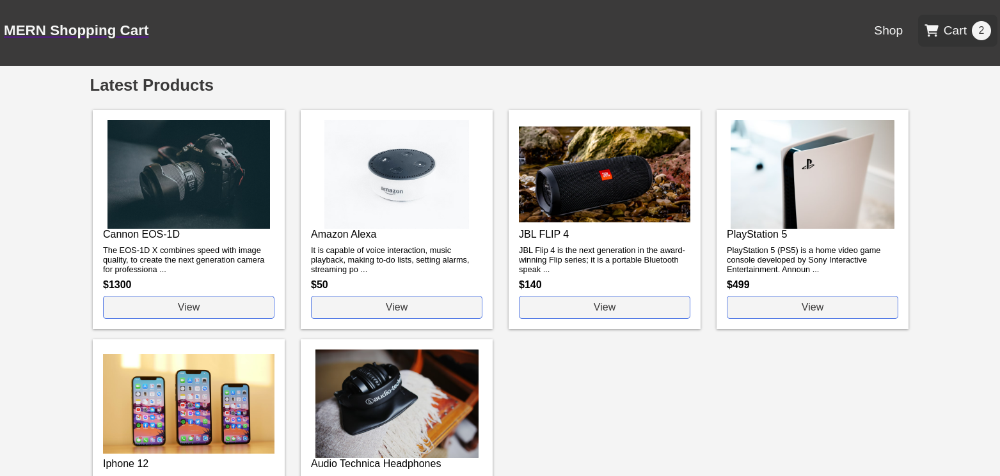

# Simple MERN Stack Shopping Cart



## Description

Shopping cart application build with MERN stack and using RESTful API. Responsive front-end design, uses Redux for state management, Node & Express for API, MongoDB as database.

## Technologies & Tools

### Front-end:

- React
- Redux

### Backend:

- Node/Express
- MongoDB/Mongoose

## Installation and Usage

### Requirements:

- Node.js installed
- MongoDB connection

### Steps:

1. Clone repo on your local computer:

```
$ git clone https://github.com/kaloyan/react-ecommerce-cart.git
```

2. Install packages

- for backend:

```
$ cd react-ecommerce-cart
$ npm install
```

- for frontend:

```
$ cd frontend
$ npm install
```

This will install all dependencies.

3. Configure application

```
$ cp .env.example .env
```

- Edit `.env` file and set your MongoDB URI and PORT

4. Build application.

```
$ npm run build
```

- Move `frontend/build` folder in `backend`

5. Import samle data in database:

```
$ node backend/scripts/productsSeeder.js
```

6. Run application

```
$ npm start
```
